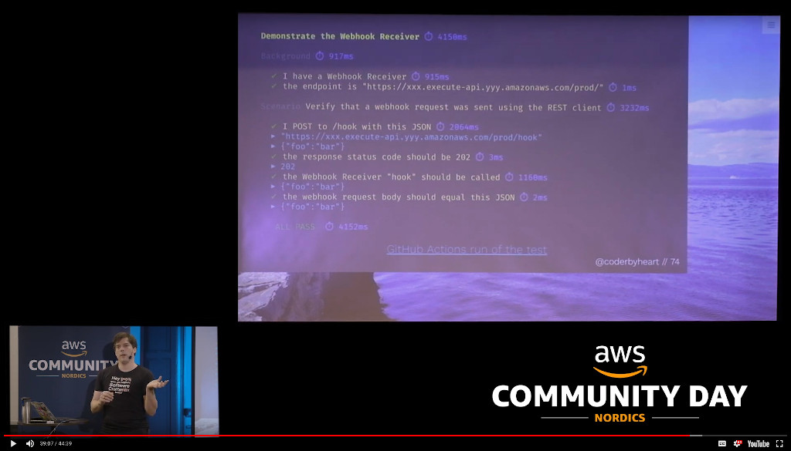

# BDD Feature Runner for AWS

An implementation of a [Gherkin](https://docs.cucumber.io/gherkin/) feature
runner for cloud native applications made with AWS.

Example usage:
[bdd-feature-runner-aws-example](https://github.com/coderbyheart/bdd-feature-runner-aws-example).

## Motivation

[Video](https://youtu.be/yt7oJ-To4kI) ·
[Slides](https://coderbyheart.com/it-does-not-run-on-my-machine/)

## Installation

> Note: This package is hosted on the GitHub package registry and
> [npm needs to be configured](https://help.github.com/en/articles/configuring-npm-for-use-with-github-package-registry#installing-a-package)
> in order to use it.

    echo "@coderbyheart:registry=https://npm.pkg.github.com" >> .npmrc
    npm i --save-dev @coderbyheart/bdd-feature-runner-aws

## Special annotations

### On Features

- `@Skip`: Do not run this feature
- `@Only`: Run only this feature
- `@Last`: Run this feature after all others

### On Scenarios

- `@Retry`: configures the retry behaviour. Pass one or multiple settings to
  override the default behaviour. Example:
  `@Retry=failAfter:3,maxDelay:100,initialDelay:50`.
